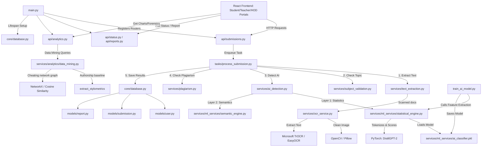

# ARCHITECTURE AUDIT & GEDE INTEGRATION PLAN
## AI-Based Assignment Plagiarism Detection System

This document provides a comprehensive software architecture audit of the **AI-Based Assignment Plagiarism Detector** repository and outlines a detailed, low-risk integration plan to replace the HuggingFace Hello-SimpleAI/HC3 training dataset with the local **GEDE (Generative Essay Detection in Education)** dataset.

---

## TASK 1: ARCHITECTURE SCAN

### 1. Overall System Architecture
The system is built as a decoupled, multi-tiered application:
*   **Frontend**: A modern Single Page Application (SPA) built using **React.js (Vite)**, styled with **Tailwind CSS**, and utilizing **Recharts** for institutional analytics.
*   **Backend API**: A high-performance RESTful service built on **FastAPI**, with **SQLAlchemy** ORM mapping data to an **SQLite** database (`plagiarism.db`).
*   **Asynchronous Processing**: Background tasks are decoupled using **Celery** with **Redis** as a message broker.
*   **Machine Learning (NLP/Vision)**: A hybrid AI/ML subsystem implementing two-layer AI detection (statistical analysis with `DistilGPT-2` + stylistic heuristics), peer-to-peer plagiarism checking (`TF-IDF` + Cosine similarity), and document text/visual preprocessing (using `OpenCV`, `TrOCR`, and `EasyOCR` local pipelines).

### 2. Folder Structure
The repository is organized as follows:
```
AI based Assignment Plagiarism Detector/
├── backend/                         # FastAPI Backend
│   ├── api/                         # API Routers (Auth, Submissions, Reports, Analytics, Status)
│   ├── core/                        # Core configuration, security, and DB setup
│   ├── models/                      # SQLAlchemy Database Models (User, Submission, Report)
│   ├── schemas/                     # Pydantic Schemas for API validation
│   ├── services/                    # Core Business Logic / NLP Services
│   │   ├── analytics/               # Forensic Analytics & Data Mining (data_mining.py)
│   │   ├── ml_services/             # AI Classification & Feature Extraction Engines
│   │   │   ├── ai_classifier.pkl   # Pickled RandomForest Model
│   │   │   ├── semantic_engine.py   # Style & Transition Heuristic Evaluator
│   │   │   └── statistical_engine.py# perplexity, entropy, burstiness using DistilGPT-2
│   │   ├── ocr_service.py           # OpenCV processing + TrOCR / EasyOCR pipeline
│   │   ├── plagiarism.py            # Cosine similarity matching
│   │   ├── subject_validation.py    # Syllabus/keyword matching relevance check
│   │   └── text_extraction.py       # DOCX, TXT, PDF parser (with OCR fallback)
│   ├── tasks/                       # Celery Task Definitions
│   │   ├── celery_app.py            # Celery broker configuration
│   │   └── process_submission.py    # Orchestration of file evaluation pipeline
│   ├── requirements.txt             # Python packages
│   ├── main.py                      # FastAPI entry point
│   ├── seed_users.py                # Admin/Student/Teacher user seeding
│   ├── train_ai_model.py            # Model training script (currently downloads HC3)
│   └── test_*.py                    # Test suites (e.g. test_e2e.py, test_ai_layers.py)
├── src/                             # React SPA Frontend
│   ├── components/                  # Common React UI elements
│   ├── pages/                       # Portal Views (Student, Teacher, HOD, Login, Register)
│   ├── App.jsx                      # Main React Router setup
│   └── index.css                    # Global styling & Tailwind directives
```

### 3. Execution Pipeline Flow
When a file is submitted, it moves through the following pipelines:
1.  **Preprocessing Pipeline**: Documents (`.txt`, `.docx`, `.pdf`, or images) are mapped by type. If a scanned PDF or image is detected, it is sent to `ocr_service.py` where OpenCV applies perspective correction (document warping), shadow removal, and denoising prior to text extraction.
2.  **Feature Extraction Pipeline**: Extracted text is fed into the Fusion Engine.
    *   **Layer 1 (Statistical)**: Text is tokenized and processed through a local `DistilGPT-2` model to calculate next-token cross-entropy loss. From these losses, **mean perplexity**, **perplexity variance (burstiness)**, and **entropy** are computed.
    *   **Layer 2 (Semantic)**: Text is evaluated for word frequencies against pre-defined regex lists representing transition markers, personal voice, and generic AI phrases.
3.  **Training Pipeline**: Currently, `train_ai_model.py` downloads a portion of the HuggingFace `Hello-SimpleAI/HC3` dataset, runs the statistical feature extraction on human and ChatGPT answers, and fits a scikit-learn `RandomForestClassifier` on these 3 features. It pickles this model to `ai_classifier.pkl`.
4.  **Inference Pipeline**: The backend runs the dual-layer fusion by combining the Random Forest statistical likelihood ($60\%$) with the semantic heuristic score ($40\%$) to generate a final AI score and decision label.
5.  **Evaluation Pipeline**: Evaluates training set accuracy. Integrations are verified through `test_e2e.py` by making mock API calls.

### 4. System Dependency Graph


---

## TASK 2: TRACE THE COMPLETE FLOW

The step-by-step execution path of a student submitting an assignment until prediction and response:

1.  **Entry Point**: The student logs into the React SPA and navigates to the **Student Dashboard** (`src/pages/StudentPortal.jsx`).
2.  **API/UI Upload**: The student selects a subject and uploads their assignment file. The frontend makes a `multipart/form-data` `POST` request to `${API_URL}/api/submit`.
3.  **FastAPI Endpoint**: The request is intercepted by `backend/api/submissions.py` (`submit_assignment` function).
    *   Saves the uploaded file to the local disk (`backend/uploads/`).
    *   Creates a `Submission` record in the SQLite database with `status="pending"`.
    *   Enqueues `process_submission_task.delay(submission.id)` to Celery/Redis and returns a `202 ACCEPTED` status with `submission_id` back to the frontend.
4.  **Celery Worker Execution**: A Celery worker processes the queue task (`backend/tasks/process_submission.py`):
    *   Updates the database `Submission` status to `"processing"`.
    *   Calls `extract_text()` from `backend/services/text_extraction.py`.
5.  **Text Preprocessing & Extraction**:
    *   If it is a `.txt` or `.docx`, text is extracted directly.
    *   If it is a `.pdf`, it attempts digital extraction. If the word count is $<20$, it falls back to OCR: converting pages to JPEGs and running TrOCR (or local EasyOCR) to extract handwritten/scanned text.
    *   A visual perceptual hash (`dHash`) is computed for images to detect visual plagiarism.
6.  **Subject Relevance Check**: The extracted text is run through `backend/services/subject_validation.py` (`validate_subject_relevance` function) to check that key concepts match the selected course syllabus keywords.
7.  **AI Detection Service Call**: The cleaned text is passed to `backend/services/ai_detection.py` (`analyze_ai_content` function).
8.  **Layer 1 (Statistical Engine)**: `analyze_ai_content` invokes `analyze_statistics` from `backend/services/ml_services/statistical_engine.py`:
    *   Passes text through the `distilgpt2` tokenizer and runs it on the PyTorch model.
    *   Calculates cross-token cross-entropy losses.
    *   Extracts features: **mean perplexity**, **perplexity variance (burstiness)**, and **entropy**.
    *   Constructs a feature vector `[[mean_perplexity, perplexity_variance, entropy]]`.
    *   Passes the feature vector to `classifier.predict_proba(features)[0][1]` (the loaded RandomForest classifier) to compute `ai_likelihood`.
9.  **Layer 2 (Semantic Engine)**: `analyze_ai_content` invokes `analyze_semantics` from `backend/services/ml_services/semantic_engine.py` to calculate stylistic heuristic scores (lexical diversity, transition marker density, personal voice counts).
10. **Inference Fusion**: The fusion logic fuses scores ($0.6 \times \text{Layer 1} + 0.4 \times \text{Layer 2}$), resolves disagreements, and generates a final decision: `Original`, `AI-generated`, or `Mixed`.
11. **Plagiarism Detection**: The task calls `check_plagiarism` from `backend/services/plagiarism.py` which computes TF-IDF representations of the new text against other submissions in the database for the same subject, returning the maximum cosine similarity score.
12. **Save Report**: The task creates a `Report` record containing the final `ai_score`, `plagiarism_score`, `label`, `processed_text` snippet, and `visual_hash`. It marks the `Submission` status as `"completed"`.
13. **Response Display**: The student's dashboard polls `/api/status/{submission_id}`. Once completed, it fetches `/api/report/{submission_id}` and renders the full evaluation report.

---

## TASK 3: FEATURE EXTRACTION ANALYSIS

The extraction of mathematical signals and stylistic heuristics occurs in the `ml_services` modules. The specifications of these operations are defined below:

| Feature | Computation File | Function | Input | Output | Feature Vector Format |
| :--- | :--- | :--- | :--- | :--- | :--- |
| **Mean Perplexity** | [statistical_engine.py](file:///d:/AI%20based%20Assignment%20Plagiarism%20Detector/backend/services/ml_services/statistical_engine.py) | `analyze_statistics` | `text: str` | `mean_perplexity: float` | The raw scalar output is structured into a list of lists: `[[mean_perplexity, perplexity_variance, entropy]]` for prediction. |
| **Burstiness** (Perplexity Variance) | [statistical_engine.py](file:///d:/AI%20based%20Assignment%20Plagiarism%20Detector/backend/services/ml_services/statistical_engine.py) | `analyze_statistics` | `text: str` | `perplexity_variance: float` | Included in the 3D statistical feature vector: `[[mean_perplexity, perplexity_variance, entropy]]`. |
| **Entropy** | [statistical_engine.py](file:///d:/AI%20based%20Assignment%20Plagiarism%20Detector/backend/services/ml_services/statistical_engine.py) | `analyze_statistics` | `text: str` | `entropy: float` | Included in the 3D statistical feature vector: `[[mean_perplexity, perplexity_variance, entropy]]`. |
| **Sentence Statistics** (Word & Sentence Counts) | [process_submission.py](file:///d:/AI%20based%20Assignment%20Plagiarism%20Detector/backend/tasks/process_submission.py) | `_run_pipeline` | `cleaned_text: str` | `word_count: int`, `sentence_count: int` | These are scalars stored as integers in the database `Report` record; they are not passed to the AI classifier. |
| **Stylometric Heuristics** (Layer 2) | [semantic_engine.py](file:///d:/AI%20based%20Assignment%20Plagiarism%20Detector/backend/services/ml_services/semantic_engine.py) | `analyze_semantics` | `text: str` | `generic_phrasing: float`, `lack_of_personal_voice: float`, `over_structured_coherence: float`, `repetitiveness: float` | A dictionary of float scores between `0.0` and `1.0`. These are fused mathematically using weighted heuristics rather than a machine learning classifier. |
| **Data Mining Stylometrics** | [data_mining.py](file:///d:/AI%20based%20Assignment%20Plagiarism%20Detector/backend/services/analytics/data_mining.py) | `extract_stylometrics` | `text: str` | `word_length: float`, `sentence_length: float`, `ttr: float`, `punctuation_density: float` | A dictionary of float values. These are used in the advanced analytics module for Z-score historical authorship style-shift checks. |

---

## TASK 4: TRAINING PIPELINE ANALYSIS

The current model training pipeline is encapsulated inside `backend/train_ai_model.py` and operates as follows:

1.  **Loading the Dataset**: It calls `fetch_real_data()`. This downloads the HuggingFace `Hello-SimpleAI/HC3` dataset in JSONL format from `https://huggingface.co/datasets/Hello-SimpleAI/HC3/resolve/main/all.jsonl` using a raw HTTP request via `urllib.request`.
2.  **Preprocessing & Label Creation**:
    *   Iterates through each JSONL line.
    *   Extracts human answers (`row["human_answers"][0]`) and labels them as `0` (Human).
    *   Extracts ChatGPT answers (`row["chatgpt_answers"][0]`) and labels them as `1` (AI).
    *   Filters out answers with length $\le 50$ characters.
3.  **Feature Extraction**:
    *   Passes each valid text block to `analyze_statistics(text)` imported from `statistical_engine.py`.
    *   Collects the resulting `[mean_perplexity, perplexity_variance, entropy]` and appends them to the feature list `X`, while appending the label to `y`.
4.  **Train/Test Split**:
    *   *Warning/Audit Note*: There is **no train/test split** in the current training script. It trains on all extracted samples ($100\%$ of `X` and `y`) and calculates training set accuracy directly.
5.  **Model Training**:
    *   Instantiates a Scikit-Learn `RandomForestClassifier(n_estimators=100, max_depth=5, random_state=42)`.
    *   Fits the classifier: `clf.fit(X, y)`.
6.  **Saving the Model**:
    *   Pickles the trained classifier using `pickle.dump()`.
    *   Saves it to `backend/services/ml_services/ai_classifier.pkl`.
7.  **Runtime Loading**:
    *   When the server starts or when a module imports `statistical_engine.py`, the file checks for the existence of `backend/services/ml_services/ai_classifier.pkl`.
    *   If found, it loads it via `pickle.load()` into the global variable `classifier` to run inference.

---

## TASK 5: GEDE INTEGRATION PLAN

To integrate the **GEDE (Generative Essay Detection in Education)** dataset safely without disrupting the execution architecture:

### 1. File Requirements: Is `questions.csv` required?
For the core task of **training the RandomForest classifier**, `questions.csv` is **not required**.
*   **Justification**: The classifier is a binary estimator that maps a 3D feature vector (perplexity, variance, entropy) extracted from a text block (`answer`) to a binary target label (Human `0` or AI `1`). The text blocks and author classifications are contained entirely within `essays.csv` (where `answer` is the essay text, and `text_author` indicates the author).
*   **Utility of questions.csv**: While not required to train the core classification algorithm, `questions.csv` contains valuable pedagogical context (the original prompt, discipline, course, and task type). This metadata is crucial for the future extensibility points outlined in Task 10.

### 2. Dataset Integration Points
The GEDE dataset files will be loaded locally from their current directory:
*   `D:\Assessing-LLM-Text-Detection-in-Educational-Contexts\dataset\essays.csv`
*   `D:\Assessing-LLM-Text-Detection-in-Educational-Contexts\dataset\questions.csv`

The GEDE integration will interface directly inside `train_ai_model.py`. Instead of the remote download of HC3, we will insert a local pandas ingestion process:
1.  Load `essays.csv` via `pandas`.
2.  Filter `essays.csv` based on `text_author`. Map `text_author == 'human'` to class `0` (Human) and any other author (e.g., `gpt-4o-mini-2024-07-18`, `meta-llama/Llama-3.3-70B-Instruct`, `dipper`) to class `1` (AI).
3.  Clean/extract the `answer` text.
4.  Run feature extraction via the existing `analyze_statistics` module, collect vectors, split the data into train/test sets to measure true generalization metrics, fit the Random Forest, and save the resulting file to the exact same path: `backend/services/ml_services/ai_classifier.pkl`.

---

## TASK 6: MINIMAL CHANGES PLAN

The primary guideline is to preserve the execution pipeline, APIs, databases, and UI. Only the training data source should change. The table below documents the minimal changes required:

### Modified Files

| Current File | Purpose | Current Behaviour | Required Modification | Reason | Risk Level | Dependencies |
| :--- | :--- | :--- | :--- | :--- | :--- | :--- |
| [train_ai_model.py](file:///d:/AI%20based%20Assignment%20Plagiarism%20Detector/backend/train_ai_model.py) | Compiles training dataset, extracts statistical features, trains classifier, and pickles outputs. | Downloads HuggingFace HC3 dataset via HTTP, extracts features, runs no train/test split, fits RandomForest, and pickles it. | Replace HF HC3 download with local `essays.csv` loading using `pandas`. Implement proper train/test split (`train_test_split`). Extract features via `analyze_statistics` and fit RandomForest. Print metrics (Accuracy, F1, Precision, Recall). | Integrate the GEDE dataset as the new source of ground truth while outputting training metrics. | **Low** | `pandas`, `sklearn`, `services.ml_services.statistical_engine` |

### Unmodified Files (MUST NOT be modified)
All other files in the project must remain completely intact. Specifically:
*   [main.py](file:///d:/AI%20based%20Assignment%20Plagiarism%20Detector/backend/main.py): Registers routers and handles DB lifecycle. Changing this would risk server boot loops.
*   [ai_detection.py](file:///d:/AI%20based%20Assignment%20Plagiarism%20Detector/backend/services/ai_detection.py): Fusion engine logic (60/40 scoring and disagreement overrides) must remain unchanged to preserve the inference rules.
*   [statistical_engine.py](file:///d:/AI%20based%20Assignment%20Plagiarism%20Detector/backend/services/ml_services/statistical_engine.py): Contains the active PyTorch DistilGPT-2 forward-pass calculations and features extraction. We must reuse this file for feature extraction to guarantee parity.
*   [semantic_engine.py](file:///d:/AI%20based%20Assignment%20Plagiarism%20Detector/backend/services/ml_services/semantic_engine.py): Style heuristic extraction rules must remain unchanged.
*   [plagiarism.py](file:///d:/AI%20based%20Assignment%20Plagiarism%20Detector/backend/services/plagiarism.py): Peer plagiarism comparisons must remain untouched.
*   [submissions.py](file:///d:/AI%20based%20Assignment%20Plagiarism%20Detector/backend/api/submissions.py): REST endpoint for assignment uploading must remain unchanged.
*   [process_submission.py](file:///d:/AI%20based%20Assignment%20Plagiarism%20Detector/backend/tasks/process_submission.py): The Celery background orchestration pipeline must remain unchanged.
*   **Database Models**: `user.py`, `submission.py`, `report.py` must not be modified since the database schema remains unchanged.
*   **React Frontend Pages**: No changes are needed on the frontend since the API response models are preserved.

---

## TASK 7: IMPACT ANALYSIS

| Component | Impact Assessment | Detail / Dependencies |
| :--- | :--- | :--- |
| **API** | None | Endpoints (`/api/submit`, `/api/status`, `/api/report`, `/api/analytics`) accept and return the same data structures. |
| **Frontend** | None | Component renderings and dashboard graphics require no adjustments. |
| **Database** | None | Database tables (`users`, `submissions`, `reports`) retain their exact fields and relationships. |
| **Inference** | None | The loading of `ai_classifier.pkl` and classification logic is identical. PARITY IS GUARANTEED. |
| **Saved Models** | Yes (Updated) | `ai_classifier.pkl` will be overwritten. The model size and structure (RandomForest, 3 features) are identical, but weights will reflect GEDE training. |
| **Training Scripts** | Yes (Modified) | `train_ai_model.py` is the only modified script. |
| **Evaluation** | Yes (Added) | We will generate localized testing metrics (Accuracy, Precision, Recall, F1) to verify model accuracy on GEDE. |
| **Testing** | None | The E2E script `test_e2e.py` and layer-test `test_ai_layers.py` remain valid and will run after model update. |
| **Docker** | None | If dockerized, no docker configs are changed. |
| **Requirements** | None | `pandas`, `scikit-learn`, `torch`, `transformers` are already in `requirements.txt`. |
| **Configuration** | None | `.env` and `core/config.py` remain unchanged. |

---

## TASK 8: IMPLEMENTATION ORDER ROADMAP

Nothing should be modified until the previous step passes validation.

```mermaid
gt;   1. Backup baseline model -> 2. Load local GEDE data -> 3. Train on GEDE & evaluate -> 4. Overwrite classifier -> 5. Run E2E Verification
```

### Step 1: Baseline Preservation & Setup Validation
*   **Goal**: Ensure the current system is functional and preserve the original classifier.
*   **Files**: `backend/services/ml_services/ai_classifier.pkl`
*   **Action**: Create a copy of the existing `ai_classifier.pkl` (e.g. `ai_classifier.pkl.bak`).
*   **Validation Method**: Run `python test_ai_layers.py` and verify it runs successfully.

### Step 2: Ingest local GEDE essays and questions
*   **Goal**: Ingest local GEDE data safely in the training script.
*   **Files**: `backend/train_ai_model.py`
*   **Functions**: `fetch_real_data` (or new helper `load_gede_data`)
*   **Expected Output**: Dataframes of GEDE data successfully loaded.
*   **Validation Method**: Print GEDE dataset shapes, class counts, and confirm matching question IDs.
*   **Rollback Strategy**: Revert training script modifications using git checkout.

### Step 3: Feature Extraction & Dataset Splitting
*   **Goal**: Extract statistical features from GEDE text and split into train/test sets.
*   **Files**: `backend/train_ai_model.py`
*   **Functions**: `fetch_real_data`
*   **Expected Output**: Numpy arrays `X_train`, `X_test`, `y_train`, `y_test`.
*   **Validation Method**: Assert shape of arrays matches expectations (e.g., `X_train.shape[1] == 3`).
*   **Rollback Strategy**: Revert script changes.

### Step 4: Model Training and Calibrated Evaluation
*   **Goal**: Train RandomForestClassifier and report proper generalization metrics.
*   **Files**: `backend/train_ai_model.py`
*   **Expected Output**: Fit model parameters and printed accuracy, precision, recall, and F1-score.
*   **Validation Method**: Confirm F1-score is satisfactory ($\ge 80\%$) and there is no over-fitting.
*   **Rollback Strategy**: Revert script changes.

### Step 5: Model Deployment and End-to-End Verification
*   **Goal**: Deploy new model and verify system-wide inference.
*   **Files**: `backend/services/ml_services/ai_classifier.pkl`
*   **Expected Output**: The updated `ai_classifier.pkl` is loaded by the statistical engine.
*   **Validation Method**: Run `python test_ai_layers.py` and `python test_e2e.py` to confirm the full backend process from API upload to prediction is fully operational.
*   **Rollback Strategy**: Restore `ai_classifier.pkl.bak`.

---

## TASK 9: CODE MODIFICATION STRATEGY

To ensure clean code quality:
1.  **Reuse Feature Extraction**: The training script will call `analyze_statistics` directly from `services.ml_services.statistical_engine`. This guarantees that the features extracted during training ($[mean\_perplexity, perplexity\_variance, entropy]$) are computed using the exact same tokenizer, model, and mathematical rules as during live API inference.
2.  **Parity Adapter Pattern**: Build a lightweight wrapper function in `train_ai_model.py` that reads the local CSV files, maps GEDE's text author designations to binary target labels, and feeds them into the existing feature extractor.
3.  **No Refactoring**: The internal classification and scoring code inside `statistical_engine.py` and `ai_detection.py` must remain completely untouched.

---

## TASK 10: ARCHITECTURAL EXTENSIBILITY FOR ACADEMIC METADATA

The GEDE dataset contains rich pedagogical context in `questions.csv` and `essays.csv` (`rewrite_of`, `contribution_level`, `discipline`, `discipline_group`, `course`, `task_type`). The table below outlines how the system's architecture can be extended in the future to leverage this metadata:

| Future Capability | Metatada Source | Extensibility Insertion Point | Description |
| :--- | :--- | :--- | :--- |
| **Prompt-Aware AI Detection** | `questions.csv` (`question`) | `services/ai_detection.py` | Store original assignment prompt texts in the database. During inference, compute the semantic cosine similarity (using sentence embeddings) between the student's text and the prompt. AI-generated text often matches prompt templates too uniformly or diverges conceptually (hallucination). |
| **Assignment Relevance Checking** | `questions.csv` (`question`) | `services/subject_validation.py` | Currently, `subject_validation.py` uses hardcoded keyword lists. We can replace this with a semantic validation layer that compares the submission text directly with the assignment prompt's text from `questions.csv`, rejecting off-topic submissions immediately. |
| **Subject-Specific AI Detection** | `questions.csv` (`discipline_group`, `discipline`) | `services/ml_services/statistical_engine.py` | Human writing styles vary across fields (e.g., humanities vs. physical sciences). We can load discipline-specific RandomForest classifiers depending on the subject's discipline metadata, improving prediction accuracy. |
| **Discipline-Aware Feature Engineering** | `questions.csv` (`discipline`) | `services/ai_detection.py` | Adjust the weights of Layer 1 (Statistical) and Layer 2 (Semantic) based on discipline. For example, creative writing (humanities) requires higher semantic weight, whereas technical reports (engineering) naturally exhibit uniform statistics. |
| **Plagiarism Clustering** | `essays.csv` (`question_id`) | `services/analytics/data_mining.py` | The plagiarism network graph (`get_cheating_rings`) can be grouped by specific assignment questions instead of general subjects. This allows teachers to identify collaboration circles on a per-assignment basis. |
| **Rewritten Assignment Tracking** | `essays.csv` (`rewrite_of`, `contribution_level`) | `services/ai_detection.py` | Train classifiers to detect sophisticated human-AI hybrid writing (e.g. human text rewritten by DIPPER, summarized text, or human-improved AI text) using the multi-class labels in `contribution_level`. |
| **Cross-Course Plagiarism Detection** | `questions.csv` (`course`, `discipline`) | `services/analytics/data_mining.py` | Detect copy-pasting across different courses within the same discipline group (e.g. a student submitting an essay from a Sociology class to an Anthropology class) by comparing submissions across related discipline pools. |
