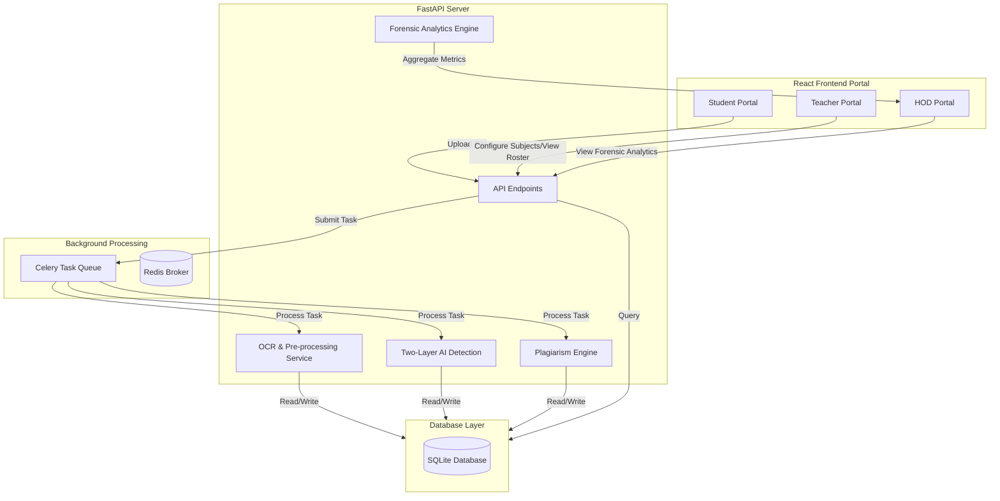

# Project Context: AI-Based Assignment Plagiarism Detector

An intelligent, role-based platform designed to verify the originality of student assignments using Natural Language Processing (NLP), statistical analysis, and computer vision. It detects both machine-generated text (AI content) and peer-to-peer plagiarism.

---

## 🏗️ System Architecture & Technology Stack

### Stack Components:
*   **Frontend:** React.js, Vite, Tailwind CSS, Lucide React (for UI icons), Recharts (for analytical charting).
*   **Backend:** FastAPI (Python), SQLAlchemy ORM.
*   **Database:** SQLite.
*   **Background Jobs:** Celery task queue with a Redis broker (running a synchronous fallback in environments without Redis/Celery).
*   **Core Libraries:** Scikit-learn (TF-IDF vectorizer, Random Forest classifier), PyTorch & Hugging Face Transformers (`distilgpt2`, `trocr-base-handwritten`), NetworkX (social graph clustering), OpenCV (image processing), EasyOCR / Tesseract (local OCR pipeline), PyPDF2, python-docx.

---

## 🌟 Core Features & Implementation Details

### 1. Two-Layer AI Detection Engine
Combines statistical probability modeling with stylistic heuristics to avoid simple evasion tactics:
*   **Layer 1 (Statistical):** Tokenizes input and feeds it into a local `distilgpt2` model to extract token log-probabilities, computing **Mean Perplexity**, **Entropy**, and **Burstiness** (perplexity variance). A calibrated `RandomForestClassifier` (trained on the HC3 dataset and saved as `ai_classifier.pkl`) maps these statistical outputs into an AI-likelihood probability.
*   **Layer 2 (Semantic):** Scans for stylistic signals using regex patterns:
    *   *AI Transitions:* High density of words like `furthermore`, `moreover`, `in conclusion`, `navigating the complexities`, etc.
    *   *Lack of Personal Voice:* Low density of first-person pronouns (`I`, `my`, `we`, `our`, `experience`).
    *   *Generic Phrasing:* Common boilerplate phrases (`plays a crucial role`, `testament to`, `in today's fast-paced`).
    *   *Repetitiveness:* Measures lexical diversity using Type-Token Ratio (TTR).
*   **Fusion Layer:** Integrates the two scores (60% statistical / 40% semantic). If they clash (disagreement > 40%), it dials back the confidence score, brings the final rating closer to 50%, and labels it **"Mixed"** to prevent false positives.

### 2. OCR and Image Pre-processing Pipeline
Handles handwritten document uploads, scans, and physical pages:
*   **OpenCV Pre-processing:**
    *   *Perspective Correction:* Detects 4-corner document contours and applies a warp transform to flatten/deskew the page.
    *   *Shadow Removal:* Dilates the image and computes a median blur to calculate background lighting, dividing the image by it to remove uneven shadows.
    *   *Denoising:* Applies bilateral filtering to sharpen edges and clear noise.
*   **Offline Neural OCR Extraction:** Uses a hybrid local pipeline combining CRAFT text line segmentation with **Microsoft TrOCR** (`microsoft/trocr-base-handwritten`) for high-accuracy handwritten recognition, with fallback to **EasyOCR** and **Tesseract**.
*   **Rejection Gate:** Analyzes OCR confidence scores. If the average confidence is `< 50%` with sparse text, the file is rejected to prevent grading garbage inputs.
*   **Visual Plagiarism (Perceptual Hashing):** Computes a 64-bit dHash (difference hash) for every image. If two files have matching hashes, they are flagged as visual duplicates (e.g., student copying another's photo).

### 3. Advanced Forensic Data Mining
Aggregates macro-level data for HOD dashboards:
*   **Social Network Mining (Cheating Rings):** Uses `networkx` to build a graph where students are nodes and edges represent similarity. An edge is created if students submit work in the same subject with cosine similarity `> 30%` or if their document visual hashes match. It clusters components to identify cooperative copying circles.
*   **Stylometric Profiling (Authorship Verification):** Establishes a student writing "fingerprint" using past submissions (minimum 3 baseline files) based on average word length, sentence length, vocabulary complexity (TTR), and punctuation density. New submissions are flagged as anomalies if they show a style-shift Z-score deviation `> 2.0`.
*   **Temporal Risk Analysis:** Bins submissions by hour of the day to correlate night-time "rush hours" with increased plagiarism and AI scores.
*   **Subject Vulnerability & ROI:** Computes vulnerability scores per subject (weighted plagiarism and AI ratings) and tracks grading hours saved (assumes 15 mins saved per paper).

### 4. Dynamic Teacher Subject Management
Teachers can manage their assigned subjects and sections through the Settings interface, updating their profile's database JSON structure. The dashboards dynamically filter assignments by subject/section codes.

---

## 📁 Key File Structure

*   `backend/services/ai_detection.py` - Core fusion engine.
*   `backend/services/ml_services/statistical_engine.py` - Layer 1 statistical feature extraction and ML classification.
*   `backend/services/ml_services/semantic_engine.py` - Layer 2 transition, phrasing, and voice checks.
*   `backend/services/ocr_service.py` - OpenCV filtering, visual hashing, and TrOCR / EasyOCR local neural pipeline.
*   `backend/services/subject_validation.py` - Keyword relevance checking per course.
*   `backend/services/analytics/data_mining.py` - Connected components (cheating rings), stylometrics, and macro insights.
*   `backend/train_ai_model.py` - Training script for the RandomForest statistical classifier.
*   `backend/test_pipeline_images.py` - End-to-end OCR and AI classification testing script.
*   `src/pages/HODPortal.jsx` - HOD dashboard and analytics interface.
*   `src/pages/TeacherPortal.jsx` - Teacher grade roster and subject configuration.
*   `src/pages/StudentPortal.jsx` - Student submission upload and report visualization.
